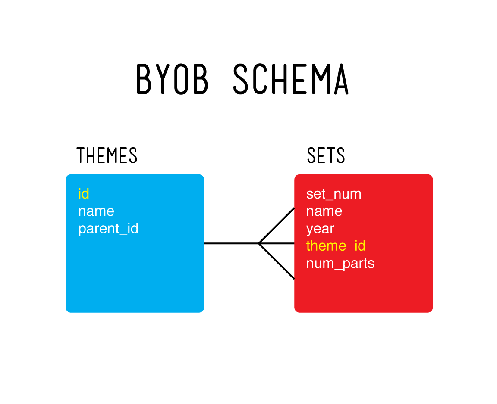

# BYOB (Build Your Own Backend)

BYOB is a one week long solo project. It is intended as a way to get comfortable with building databases using Express, Knex, and PostgreSQL.

### TOC
- [Focuses](#focuses)
- [API](#api)
  - [Schema](#schema)
  - [Endpoints](#endpoints)
    - [Themes](#themes)
    - [Sets](#sets)
- [Tech](#tech)
- [Team](#team)
- [Setup](#setup)

<div id='focuses'/>
### Focuses

- Building a RESTful API for a large dataset.

- One-to-many relational database schema design.

- Deploying to Heroku.

<div id='api'/>
### API

BYOB uses Lego data. There are two tables, `themes` and `sets`. The `sets` table is connected to the `themes` table by the `theme_id`.

#### Schema

The overall data flow is mapped out below.



<div id='endpoints'/>
#### Endpoints

**Themes**

**GET** /api/v1/themes

- Sample Response (ok) status: 200
```
[
    {
        "inc_id": 2457,
        "id": 2,
        "name": "Arctic Technic",
        "parent_id": 1,
        "created_at": "2019-11-21T18:03:54.486Z",
        "updated_at": "2019-11-21T18:03:54.486Z"
    },
    {
        "inc_id": 2461,
        "id": 11,
        "name": "Off-Road",
        "parent_id": 5,
        "created_at": "2019-11-21T18:03:54.487Z",
        "updated_at": "2019-11-21T18:03:54.487Z"
    },
    ...
  ]
```
- Sample Response (error) status: 404
```
{
    error: 'The themes data can not be found.'
}
```

**GET** /api/v1/themes/:id

- Parameter (id) example: `/api/v1/themes/2`

- Sample response (ok) status: 200
```
{
    "inc_id": 2457,
    "id": 2,
    "name": "Arctic Technic",
    "parent_id": 1,
    "created_at": "2019-11-21T18:03:54.486Z",
    "updated_at": "2019-11-21T18:03:54.486Z"
}
```
- Sample Response (error: incorrect or no id provided) status: 404
```
{
    error: 'The theme data you are looking for can not be found. Please try another theme id.'
}
```
- Sample Response (error: server down) status: 500
```
{
    error: 'There were problems connecting to the database.'
}
```

**POST** /api/v1/themes

- Required Body Parameters (JSON format)
```
{
    id: <Integer>,
    name: <String>,
    parent_id: <Integer>
}
```
- Sample response (ok) status: 200
```
{
    <inc_id>: <id>
}
```
- Sample Response (error: incorrect body information provided) status: 422
```
{
    error: Expected format:
      {
        id: <Integer>,
        name: <String>,
        parent_id: <Integer>
      }.
      You're missing a <requiredParameter> property.`
}
```
- Sample Response (error: server down) status: 500
```
{
    error: default message
}
```

**DELETE** /api/v1/themes/:id

- Parameter (id) example: `/api/v1/themes/2`

- Sample response (ok) status: 200
```
{
    <inc_id>: <id>
}
```
- Sample Response (error: incorrect or no id provided) status: 422
```
{
    error: default message
}
```

**Sets**

**GET** /api/v1/sets

- Sample Response (ok) status: 200
```
[
    {
        "inc_id": 105058,
        "set_num": "2",
        "name": "St. Germain",
        "year": 1542,
        "theme_id": 273,
        "num_parts": 1,
        "created_at": "2019-11-21T20:34:27.647Z",
        "updated_at": "2019-11-21T20:34:27.647Z"
    },
    {
        "inc_id": 105059,
        "set_num": "2",
        "name": "St. Germain",
        "year": 1542,
        "theme_id": 273,
        "num_parts": 1,
        "created_at": "2019-11-21T20:35:43.482Z",
        "updated_at": "2019-11-21T20:35:43.482Z"
    },
    ...
  ]
```
- Sample Response (error) status: 404
```
{
    error: 'The sets data can not be found.'
}
```

**GET** /api/v1/sets/:id

- Parameter (id) example: `/api/v1/sets/105058`

- Sample response (ok) status: 200
```
{
    "inc_id": 105058,
    "set_num": "2",
    "name": "St. Germain",
    "year": 1542,
    "theme_id": 273,
    "num_parts": 1,
    "created_at": "2019-11-21T20:34:27.647Z",
    "updated_at": "2019-11-21T20:34:27.647Z"
}
```
- Sample Response (error: incorrect or no id provided) status: 404
```
{
    error: 'The set data you are looking for can not be found. Please try another set id.'
}
```
- Sample Response (error: server down) status: 500
```
{
    error: 'There were problems connecting to the database.'
}
```

**POST** /api/v1/sets

- Required Body Parameters (JSON format)
```
{
    set_num: <String>,
    name: <String>,
    year: <Integer>,
    theme_id: <Integer>,
    num_parts: <Integer>
}
```
- Sample response (ok) status: 200
```
{
    <inc_id>: <id>
}
```
- Sample Response (error: incorrect body information provided) status: 422
```
{
    error: Expected format:
      {
        set_num: <String>,
        name: <String>,
        year: <Integer>,
        theme_id: <Integer>,
        num_parts: <Integer>
      }.
      You're missing a <requiredParameter> property.`
}
```
- Sample Response (error: server down) status: 500
```
{
    error: default message
}
```

**DELETE** /api/v1/sets/:id

- Parameter (id) example: `/api/v1/sets/105058`

- Sample response (ok) status: 200
```
{
    <inc_id>: <id>
}
```
- Sample Response (error: incorrect or no id provided) status: 422
```
{
    error: default message
}
```

### Tech

- This project was built with Express, Knex, and PostgreSQL.

- Deployed with Heroku.

### Team (solo)

- Quinne Farenwald (https://github.com/qfarenwald)

### Set Up

Instructions
```
example command
```
